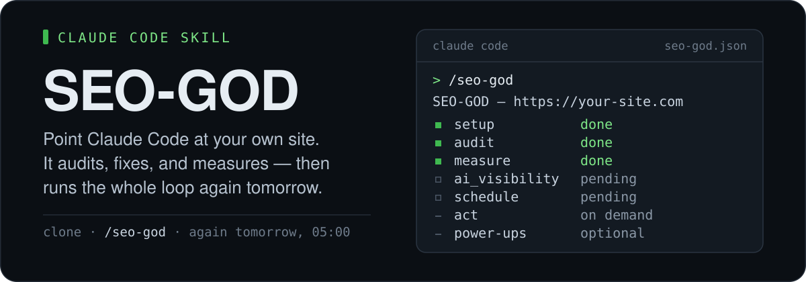
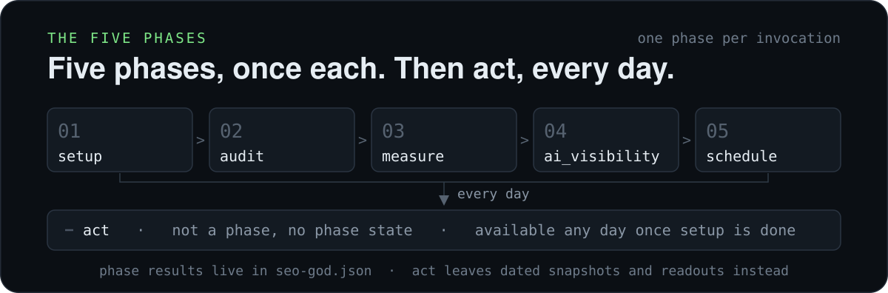
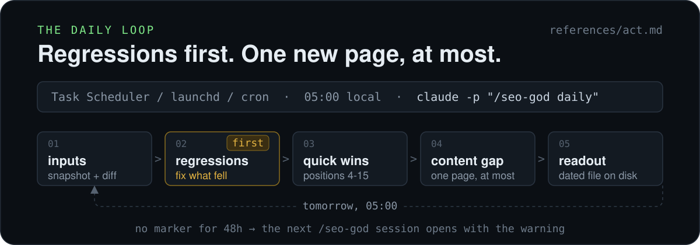

<p align="center">
  
</p>

<p align="center">
  <a href="https://claude.com/claude-code"></a>
  
  <a href="#what-you-need"></a>
  <a href="LICENSE"></a>
</p>

`seo-god` turns Claude Code into an SEO operator for a site you own.

It crawls your site with a local [OpenSEO](https://github.com/every-app/open-seo) container. It fixes
what it finds, in your repo, behind your own build. It reads your real numbers out of Google Search
Console and diffs today against yesterday. Then it does the whole thing again tomorrow, on a schedule
you install once.

It never scrapes Google. The entire free path runs without a single paid API key.

## Proof

The five phases here are a rewrite of a pipeline that runs daily on a production site.

The code in this repo is new. The method survived production. So did the review order, and the
failure modes it guards against.

You do not have to take my word for any of it. The [smoke report](./docs/SMOKE.md) is an
end-to-end run against a live test fixture, failures included. The [eval](./docs/EVAL.md) is 240
runs with the numbers. Both are in this repo.

## What it does

<p align="center">
  
</p>

Five phases, one per invocation. They are numbered in the order the skill's own menu prints them, and
the order it resumes in. Phase results land in `seo-god.json` in your project, so the next run knows
where you stopped.

The unnumbered row is the daily loop. `act` is not a phase and carries no phase state. It leaves
dated snapshots and readouts in your repo instead, and it is available any time once setup is done.

| | Phase | What happens |
| --- | --- | --- |
| 1 | [**setup**](references/setup.md) | Boots OpenSEO in Docker, registers your site, writes `seo-god.json`. The pass every first run does before anything else. |
| 2 | [**audit**](references/audit.md) | Crawls your site with the local OpenSEO container and triages every issue by impact. Then it fixes the ones that live in your repo: titles, metas, broken links, thin content. Your own build and typecheck are the gate. |
| 3 | [**measure**](references/measure.md) | Walks you through connecting Google Search Console, writes a dated snapshot into your repo, and diffs it against the last one. The review order is fixed: regressions, then quick wins at positions 4-15, then new queries. |
| 4 | [**ai_visibility**](references/ai-visibility.md) | Locks ten prompts for your niche on the first run and never edits them again, then measures how often your domain shows up for them. Read the note below before you quote that number anywhere. |
| 5 | [**schedule**](references/schedule.md) | Installs the loop as a real OS job (Task Scheduler, launchd or cron) or as a cloud routine. The skill asks which. Both come with a 48-hour self-check that surfaces a run that went missing. |
| — | [**act**](references/act.md) | *The daily loop, on demand.* Fix what regressed. Improve two or three pages that already almost rank. Add at most one new page, and only if the data asked for it. Leave a dated readout behind. |

<p align="center">
  
</p>

<p align="center"><em>You never see that answer. You can check whether your page was in the results at all.</em></p>

> [!IMPORTANT]
> **What "AI visibility" measures, exactly.** On the free path it measures whether your domain
> appears in the *search results* for your locked prompts. That is a search-visibility proxy, and it
> is not proof that an assistant cited you.
>
> Being the answer AI engines cite is the goal. The proxy is worth tracking because an assistant that
> searches can only ground an answer in pages it can retrieve. A domain absent from the results can
> never be quoted. A domain present in them still might not be.
>
> Asking models directly is an [optional power-up](references/power-ups.md), not the free path. The
> readout uses those words, never "citation rate".

## The daily loop

<p align="center">
  
</p>

The order never changes: **inputs → regressions → quick wins → content gap → readout.**

A quick win is worth nothing on a site that broke yesterday. A new page is worth even less.

Unattended runs ask zero questions. A run that cannot reach OpenSEO degrades instead of guessing. It
does what the available data supports, and it names what was missing in the readout.

**The scheduled run edits files in your repository while you are not there.** Behind your own build
gate. And it **never commits.** The changes wait in your working tree for you to review, next to a
dated readout saying what it did and why.

## Install

**macOS / Linux**

```bash
git clone https://github.com/AKCodez/seo-god ~/.claude/skills/seo-god
```

**Windows** — the same destination, `%USERPROFILE%\.claude\skills\seo-god`:

```powershell
git clone https://github.com/AKCodez/seo-god "$env:USERPROFILE\.claude\skills\seo-god"
```

Then open Claude Code in the repository of the site you want to work on, and type:

```
/seo-god
```

That is the whole install.

The first run creates `seo-god.json` in that project: site URL, phase statuses, schedule mode. Every
later run reads it and resumes where you stopped. Commit that file. It holds no keys, tokens or
passwords.

The `.seo-god/` directory created next to it is different. It goes into your `.gitignore` before
anything is written into it, and it is never committed. That is where secrets, the run marker and
local scratch live.

## What you need

- **A website you own, and one that is publicly reachable.** Any stack. Repo access strongly preferred, because the fixes are edits in your repository, gated by your own build. The crawler is OpenSEO's and it blocks private and loopback targets with no override. So `localhost`, a `.local` name or a private IP cannot be audited. Put a public tunnel in front of a local site first (a `cloudflared` quick tunnel works), or point it at a deployed staging domain.
- **Claude Code.**
- **Docker** — Desktop on macOS and Windows, Engine plus Compose v2 on Linux. OpenSEO runs locally from a published image, and nothing is built from source.
- **No paid API keys.** The free path is complete, end to end.

One honest limit, and it is the rank numbers. Tracked keyword positions, search volume, keyword
difficulty and backlink data all need the DataForSEO power-up below. Without it you measure from
three free sources: your crawl, your own Search Console data, and the locked prompt set. Anything the
skill could not measure is reported as *not measured*, never as zero.

## Power-ups

<p align="center">
  
</p>

All three are optional. They are offered in context, never assumed, and the skill is complete without
them. Details in [references/power-ups.md](references/power-ups.md).

| Power-up | | What it adds |
| --- | --- | --- |
| **DataForSEO** | optional | Real search volume, keyword difficulty and backlink summaries. Budget-capped before the first call by design: a `$0.50` default per-run cap (env-tunable), a `$2.00` balance floor that disables the paid plane outright, and a spend line in every readout that spent, or that ran with the paid plane disabled. |
| **LLM API keys** | optional | Upgrades AI-visibility measurement from a search-results proxy to direct model probing — the same locked prompts, asked to the models themselves. |
| **Telegram digest** | optional | The daily run ends with one plain-text message on your phone. Outbound only, and it fires only on runs that complete: no message means the run did not finish. |

## What it will never do

<p align="center">
  
</p>

Hard rules, not guidelines. Every phase file is subordinate to them, and a phase that appears to
conflict with one is required to stop and say so.

- **Secrets stay in a gitignored env file** — `.seo-god/secrets.env`, gitignored at creation, never printed, never committed.
- **Missing data is reported as missing**, never zero-filled and never extrapolated. Partial coverage is labelled partial.
- **No bought links, no fake reviews, no auto-posting** to social or forums, and no fabricated claims on pages it writes. Directory submissions stay owner-driven.
- **Any paid API path is budget-capped before the first call** — a per-run bound checked before the first call, a balance floor wherever the provider exposes a balance, and a spend ledger. No code path spends money with no cap in force, and raising the cap is yours alone to do. ([references/power-ups.md](references/power-ups.md) names which parts each provider supports. The LLM providers expose no balance endpoint, so that plane is capped and ledgered but has no floor.)
- **No SERP scraping of Google**, anywhere in the skill, with or without a key.
- **Scheduled runs come with failure visibility.** If no run marker appears for 48 hours, your next `/seo-god` session opens with that warning before anything else.
- **It asks for the narrowest permissions that work.** For the turn it runs in, the skill requests `curl` (the local OpenSEO container is an HTTP API) and read-only `git`: `status`, `diff`, `log`, `check-ignore`, `rev-parse`. `git add`, `git commit` and `git push` are deliberately not among them. Nothing in this skill ever asks you to turn permission checks off wholesale.

## Tested on

I built and verified this end to end on **Windows 11 + Git Bash**, driving real Docker (29.6.2,
Compose v5.3.1) and a real OpenSEO container (0.1.3) against a live test fixture. A 7-page crawl. 10
issue rows across 6 types. Both deliberately seeded defects found, triaged and fixed behind the build
gate.

The whole run is written up in **[docs/SMOKE.md](docs/SMOKE.md)**, including the parts that failed,
with every finding marked fixed or still open. Read it before you trust this with a site.

The macOS and Linux paths are stub-verified and written against documented behaviour. launchd, cron,
the POSIX runner. None of them has been exercised on a real host yet.

**Help wanted:** run it on macOS or Linux and open an issue with what happened, working or broken.
That is the single most useful contribution to this repo right now.

## Uninstall

Remove the schedule first if you installed one. The installer printed the command for your OS, and
[references/schedule.md](references/schedule.md) carries all three: `Unregister-ScheduledTask` on
Windows (§2.2), `launchctl bootout` **plus** deleting the plist on macOS (§2.3), and the
`crontab -e` line on Linux (§2.4). Then delete the folder:

```bash
rm -rf ~/.claude/skills/seo-god
```

```powershell
Remove-Item -Recurse -Force "$env:USERPROFILE\.claude\skills\seo-god"
```

`seo-god.json`, your snapshots and your readouts live in your own repository. Removing the skill
leaves every one of them alone.

## Under the hood

[`SKILL.md`](SKILL.md) is a thin orchestrator. It detects state, routes to exactly one phase file in
[`references/`](references/), and loads that file only when the phase runs. The full design is in
[docs/DESIGN.md](docs/DESIGN.md): every decision, what is deliberately out of scope, and the success
criteria this was built against.

The skill's description is the only thing that decides whether Claude Code loads it for a given
request. So it was measured, not guessed. [docs/EVAL.md](docs/EVAL.md) is a 240-run triggering eval:
the wording, the false-positive set, and the numbers it moved.

Contributing: run `node scripts/skill-lint.mjs` before you open a PR. It checks the structural rules
(SKILL.md's length and routing, every `references/*.md` reachable, both shell runners parsing) and
exits non-zero on a violation.

## License

[MIT](LICENSE)
